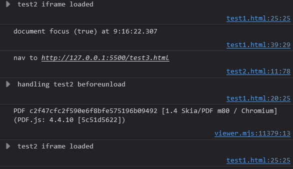
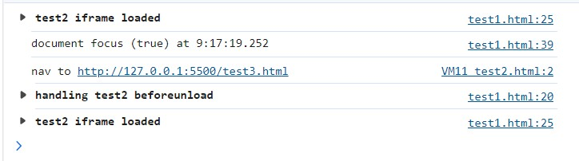
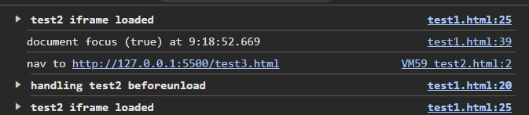

# Chrome `iframe` Navigation Loses Document Focus

This reproduces an issue I'm having with Chrome's `document.hasFocus()` becoming false once iframe navigation occurs.

In Chrome, when the iframe navigates, you can see focus is gained (if not already attained) when the link inside the iframe is clicked. Document focus is then immediately lost once the iframe navigates and is lost until the user clicks again.

Firefox and Edge do not appear to have the same problem and are functioning the way Chrome *used* to function.

Repro Steps:
- open test1.html page w/ console open
- click link inside iframe to navigate
- observe the line `document focus (false) at {time}` (only Chrome exhibits this behavior)

<figure>
    
    <figcaption>Chrome Console Log: <code>document.hasFocus()</code> becomes false when iframes navigate.</figcaption>
</figure>

<figure>
    
    <figcaption>Firefox Console Log: <code>document.hasFocus()</code> stays true when iframes navigate.</figcaption>
</figure>

<figure>
    
    <figcaption>Edge Console Log: <code>document.hasFocus()</code> stays true when iframes navigate.</figcaption>
</figure>

<figure>
    
    <figcaption>Brave Console Log: <code>document.hasFocus()</code> stays true when iframes navigate.</figcaption>
</figure>

| Browser | Version                                                                                                                                                      |
| ------- | ------------------------------------------------------------------------------------------------------------------------------------------------------------ |
| Chrome  | 126.0.6478.183 (Official Build) (64-bit) (cohort: M126 Rollout)   <b>Revision</b> 2e81dea53f5ecdc1c057e4c70ecd66151987296a-refs/branch-heads/6478@{#1777} |
| Firefox | 128.0.2 (64-bit)                                                                                                                                             |
| Edge    | 126.0.2592.113 (Official build) (64-bit)   **Revision**	088a59f740646b4e18b4a42c30503103c0b1b0aa                                                          |
| Brave   | 1.67.134 Chromium: 126.0.6478.186 (Official Build) (64-bit)   **Revision**	e27c9744a0ed98bfa60e287af7e5eaffde15bd57                                       |